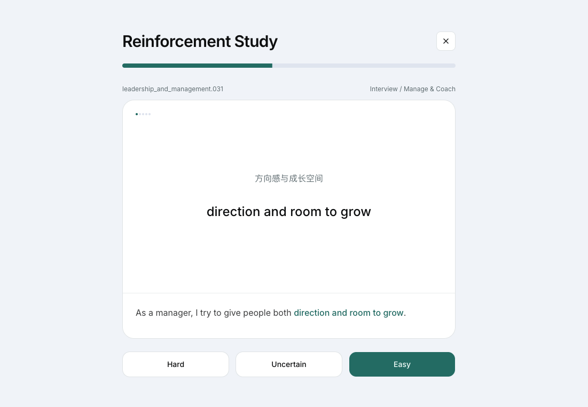

# UX Career English

Try it in your browser 👉 **[Live Demo](https://rrrick-code.github.io/ux-career-english/)**

This is an AI Coding project for building a focused English learning app for a UX/UI/Product Designer preparing for job search, interviews, and workplace communication. All learning content in this project is AI-generated.

## What It Does

- Organizes structured English learning content as JSON, including terms, phrases, and sentence patterns.
- Provides a simple React app for browsing the content library and reviewing item details.
- Supports study flows for terms, phrases, and patterns with different modes.
- Stores study progress locally in the browser with `localStorage`.
- Validates content relationships such as taxonomy keys, ID allocation, and example-pattern linking.

## Tech Stack

- React + TypeScript
- Vite
- React Router with `HashRouter`
- shadcn UI components
- Tailwind CSS v4
- JSON content files consumed directly by the app

## AI Tools Used

- Agent app: Codex
- IDE: VS Code
- Methodology: Specs were used to bootstrap the project framework and define conventions for data operations; everything else followed a code-is-spec, vibe-coding workflow.
